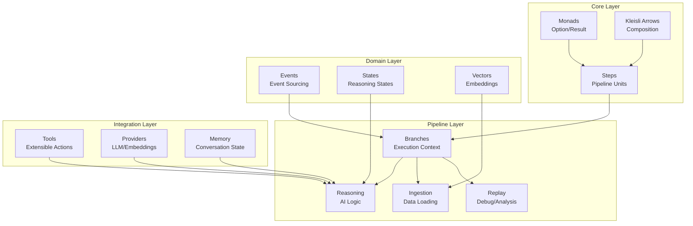

# MonadicPipeline: Architecture Summary & Recommendations

## Quick Architecture Overview



## Architecture Strengths (8.5/10)

### ✅ **Exceptional Functional Design**
- **Category Theory Implementation**: Proper Kleisli arrows and monadic composition
- **Type Safety**: Result/Option monads eliminate null reference exceptions
- **Immutable State**: Event sourcing with immutable data structures
- **Composability**: Pipeline components compose mathematically correctly

### ✅ **Clean Architecture**
- **Separation of Concerns**: Clear domain boundaries
- **Extensibility**: Tool system allows easy feature additions
- **Documentation**: Comprehensive XML docs and examples

### ✅ **Sophisticated Features**
- **Event Sourcing**: Complete audit trail with replay capabilities
- **Memory Management**: Multiple conversation memory strategies
- **LangChain Integration**: Dual native/LangChain APIs

## Critical Production Gaps

### ❌ **Persistence & Scalability**
```diff
- In-memory only vector storage
- No database persistence
- Hard-coded configurations
- No horizontal scaling support
```

### ❌ **Testing & CI/CD**
```diff
- Custom testing framework instead of xUnit
- No automated test execution
- Limited unit test coverage
- No CI/CD pipeline
```

### ❌ **Production Operations**
```diff
- No logging/monitoring
- No metrics collection
- No containerization
- No security framework
```

## Priority Recommendations

### 🔥 **IMMEDIATE (Weeks 1-4)**

#### 1. Add Production Persistence
```csharp
// Current: In-memory only
public sealed class TrackedVectorStore 

// Recommended: Add persistent implementation
public interface IVectorStore 
{
    Task<IReadOnlyCollection<Vector>> GetAllAsync();
    Task AddAsync(IEnumerable<Vector> vectors);
    Task<IReadOnlyCollection<Document>> GetSimilarDocumentsAsync(/*...*/);
}
```

#### 2. Standardize Testing
```bash
# Add to MonadicPipeline.csproj
<PackageReference Include="Microsoft.NET.Test.Sdk" Version="17.8.0" />
<PackageReference Include="xunit" Version="2.4.2" />
<PackageReference Include="xunit.runner.visualstudio" Version="2.4.5" />
```

#### 3. Configuration Management
```csharp
// Add IConfiguration support
public class PipelineConfiguration
{
    public string OllamaEndpoint { get; set; }
    public int MaxTurns { get; set; }
    public int VectorStoreBatchSize { get; set; }
}
```

### ⚡ **MEDIUM TERM (Weeks 5-12)**

#### 1. Add Observability
```csharp
// Structured logging integration
services.AddSerilog();

// Metrics collection
services.AddApplicationInsightsTelemetry();
```

#### 2. Performance Optimization
```csharp
// Object pooling for frequent allocations
services.AddObjectPool<StringBuilder>();

// Async enumerable for large datasets
IAsyncEnumerable<Vector> ProcessDocumentsAsync(/*...*/);
```

#### 3. Enhanced Security
```csharp
public interface IToolSecurityValidator
{
    Task<ValidationResult> ValidateInputAsync(string toolName, string input);
    Task<bool> AuthorizeToolExecutionAsync(string userId, string toolName);
}
```

### 🚀 **LONG TERM (Months 3-6)**

#### 1. Microservices Architecture
- Service boundaries around tool execution
- Distributed pipeline coordination
- Event-driven communication

#### 2. Advanced Memory Strategies
- Vector-based memory retrieval
- Hierarchical summarization
- Long-term conversation persistence

#### 3. Developer Tooling
- Visual pipeline designer
- Debug/profiling tools
- VS Code extension

## Implementation Roadmap

### Phase 1: Production Readiness (4 weeks)
```
Week 1: Persistent storage implementation
Week 2: xUnit testing migration
Week 3: Configuration & logging
Week 4: Basic monitoring & metrics
```

### Phase 2: Enhanced Operations (8 weeks)
```
Weeks 5-6: Security framework
Weeks 7-8: Performance optimization
Weeks 9-10: Enhanced error handling
Weeks 11-12: CI/CD pipeline
```

### Phase 3: Advanced Features (12+ weeks)
```
Months 3-4: Microservices preparation
Months 5-6: Developer tooling
Ongoing: Community building & documentation
```

## Risk Assessment

| Risk | Probability | Impact | Mitigation |
|------|------------|--------|------------|
| Complex abstractions hinder adoption | High | Medium | Add training materials, simplified APIs |
| Performance issues at scale | Medium | High | Implement benchmarking, profiling |
| Security vulnerabilities | Medium | High | Security audit, input validation |
| Maintenance complexity | Low | Medium | Code documentation, team training |

## Success Metrics

### Technical Metrics
- **Performance**: <100ms average pipeline execution
- **Reliability**: 99.9% uptime for core services
- **Security**: Zero critical vulnerabilities
- **Scalability**: Support 1000+ concurrent pipelines

### Business Metrics
- **Developer Adoption**: 80% positive feedback
- **Time to Market**: 50% reduction in pipeline development
- **Maintenance Cost**: 30% reduction vs traditional approaches

## Conclusion

The MonadicPipeline project demonstrates exceptional architectural sophistication with strong functional programming foundations. The implementation of category theory concepts in a practical AI pipeline system is noteworthy and innovative.

**Primary Focus Areas:**
1. **Production hardening** through persistence and operational tooling
2. **Testing standardization** for better maintainability 
3. **Performance optimization** for scalability
4. **Security implementation** for enterprise readiness

With focused effort on these areas, this architecture could serve as a leading example of functional programming applied to AI systems, potentially influencing industry best practices.

**Overall Assessment: Excellent foundation requiring production maturity**