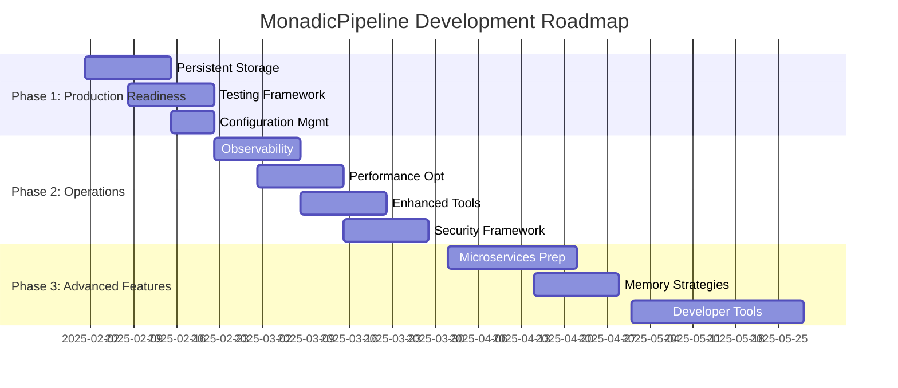

# MonadicPipeline Development Roadmap

> **Strategic Overview**: Development phases and milestones based on architectural review recommendations.

## 🛣️ Roadmap Overview

## 📅 Phase Breakdown

### Phase 1: Production Readiness (Weeks 1-4)
**Objective**: Make the system production-ready with proper persistence, testing, and configuration.

| Week | Focus Area | Key Deliverables |
|------|------------|------------------|
| 1 | **Persistence** | Persistent vector store, database integration |
| 2 | **Testing** | xUnit migration, CI/CD pipeline |
| 3 | **Configuration** | IConfiguration, environment-specific configs |
| 4 | **Integration** | End-to-end testing, deployment preparation |

**Success Criteria**:
- ✅ System can persist and recover all state
- ✅ Automated testing covers >80% of core functionality  
- ✅ Configuration externalized and environment-aware
- ✅ Ready for staging environment deployment

### Phase 2: Operations & Scale (Weeks 5-12)
**Objective**: Add operational excellence and performance optimization for scale.

| Week | Focus Area | Key Deliverables |
|------|------------|------------------|
| 5-6 | **Observability** | Structured logging, metrics, tracing |
| 7-8 | **Performance** | Benchmarking, memory optimization, pooling |
| 9-10 | **Enhanced Tools** | Type-safe tools, composition, async execution |
| 11-12 | **Security** | Authentication, authorization, input validation |

**Success Criteria**:
- ✅ Complete observability into system behavior
- ✅ Performance benchmarks established and optimized
- ✅ Tool system is type-safe and composable
- ✅ Security framework protects against common attacks

### Phase 3: Strategic Features (Months 3-6)
**Objective**: Add advanced capabilities for long-term strategic advantage.

| Month | Focus Area | Key Deliverables |
|-------|------------|------------------|
| 3 | **Microservices** | Service boundaries, distributed execution |
| 4 | **Memory Intelligence** | Advanced summarization, vector retrieval |
| 5-6 | **Developer Experience** | VS Code extension, debugging, profiling |

**Success Criteria**:
- ✅ Architecture supports distributed deployment
- ✅ Intelligent memory management with semantic retrieval
- ✅ World-class developer experience and tooling

## 🎯 Milestones & Dependencies

### Milestone 1: Production Ready (End of Month 1)
- **Dependencies**: WI-001, WI-002, WI-003, WI-004, WI-006, WI-007
- **Deliverable**: System deployed to staging environment
- **Success Metric**: 24/7 uptime in staging with real workloads

### Milestone 2: Operational Excellence (End of Month 3)
- **Dependencies**: WI-010, WI-011, WI-013, WI-014, WI-019, WI-020
- **Deliverable**: Production deployment with full monitoring
- **Success Metric**: <100ms p95 response time, 99.9% uptime

### Milestone 3: Strategic Capabilities (End of Month 6)
- **Dependencies**: WI-022, WI-025, WI-026, WI-028
- **Deliverable**: Advanced features and developer tooling
- **Success Metric**: Developer productivity metrics show 50% improvement

## 🚦 Risk & Mitigation

| Risk | Probability | Impact | Mitigation |
|------|-------------|--------|------------|
| **Complex migrations break existing functionality** | Medium | High | Comprehensive testing, gradual rollout, feature flags |
| **Performance degradation with persistence** | Medium | Medium | Early benchmarking, performance testing in CI |
| **Team learning curve on new tools** | High | Medium | Training sessions, documentation, pair programming |
| **External service dependencies** | Low | High | Fallback options, service isolation, circuit breakers |

## 📊 Success Metrics

### Technical Metrics
- **Performance**: <100ms average pipeline execution
- **Reliability**: 99.9% uptime SLA
- **Security**: Zero critical vulnerabilities
- **Quality**: >90% test coverage

### Business Metrics
- **Developer Velocity**: 50% reduction in pipeline development time
- **Adoption**: 80% positive feedback from development teams
- **Maintenance**: 30% reduction in operational overhead

## 🔄 Review & Adaptation

**Monthly Reviews**: Progress against roadmap, risk assessment, priority adjustments  
**Quarterly Reviews**: Strategic alignment, roadmap updates, technology evaluation  
**Continuous**: Stakeholder feedback, market changes, technical discoveries

---

## Next Steps

1. **Validate roadmap** with key stakeholders and technical team
2. **Assign work items** to specific developers and sprints
3. **Setup tracking** using GitHub Projects or similar tool
4. **Begin Phase 1** with persistent storage implementation
5. **Regular reviews** to adapt roadmap based on learnings

---

*This roadmap is based on the architectural review recommendations and should be adjusted based on business priorities, team capacity, and evolving requirements.*