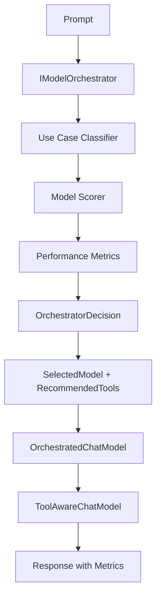

# AI Orchestrator - Model Selection and Composable Tools

## Overview

The AI Orchestrator is a sophisticated system that intelligently selects the best models and tools based on use case analysis and performance metrics. It extends the Meta-AI pipeline capabilities with automatic model routing, performance tracking, and advanced tool composition.

## Architecture

### Core Components



### Key Abstractions

1. **IModelOrchestrator**: Core interface for model and tool selection
2. **SmartModelOrchestrator**: Implementation with use case classification and performance tracking
3. **OrchestratedChatModel**: Performance-aware wrapper for automatic model selection
4. **OrchestratorBuilder**: Fluent API for configuring orchestrator instances

## Features

### 1. Intelligent Use Case Classification

The orchestrator analyzes prompts to classify them into use case types:

- **CodeGeneration**: Code writing, debugging, refactoring
- **Reasoning**: Analysis, explanation, logical deduction
- **Creative**: Story writing, content generation
- **Summarization**: Document condensation, TL;DR
- **ToolUse**: Function calling, tool invocation
- **Conversation**: General chat, Q&A

```csharp
var tools = ToolRegistry.CreateDefault();
var orchestrator = new SmartModelOrchestrator(tools, "default");

var useCase = orchestrator.ClassifyUseCase("Write a function to sort a list");
// Returns: UseCaseType.CodeGeneration
```

### 2. Performance-Aware Model Selection

Models are scored based on:
- **Type Matching**: Model type vs. use case alignment
- **Capability Matching**: Required capabilities vs. model strengths
- **Performance Metrics**: Success rate and latency tracking

```csharp
var capability = new ModelCapability(
    ModelName: "coder",
    Strengths: new[] { "code", "programming", "debugging" },
    MaxTokens: 8192,
    AverageCost: 1.5,
    AverageLatencyMs: 1200,
    Type: ModelType.Code);

orchestrator.RegisterModel(capability, codeModel);
```

### 3. Automatic Performance Tracking

Every execution is tracked for continuous optimization:

```csharp
public sealed record PerformanceMetrics(
    string ResourceName,
    int ExecutionCount,
    double AverageLatencyMs,
    double SuccessRate,
    DateTime LastUsed,
    Dictionary<string, double> CustomMetrics);
```

Metrics are automatically recorded and used to influence future model selection decisions.

### 4. Composable Tools

Advanced tool composition patterns for sophisticated workflows:

#### Retry Logic
```csharp
var reliableTool = tool.WithRetry(maxRetries: 3, delayMs: 100);
```

#### Result Caching
```csharp
var cachedTool = tool.WithCaching(TimeSpan.FromMinutes(5));
```

#### Timeout Protection
```csharp
var safeTool = tool.WithTimeout(TimeSpan.FromSeconds(10));
```

#### Performance Tracking
```csharp
var trackedTool = tool.WithPerformanceTracking(
    (name, latency, success) => 
        orchestrator.RecordMetric(name, latency, success));
```

#### Fallback Chains
```csharp
var robustTool = primaryTool.WithFallback(fallbackTool);
```

#### Parallel Execution
```csharp
var parallelTool = OrchestratorToolExtensions.Parallel(
    "parallel_search",
    "Searches multiple sources simultaneously",
    results => string.Join("\n", results),
    searchTool1, searchTool2, searchTool3);
```

#### Conditional Routing
```csharp
var conditionalTool = AdvancedToolBuilder.Switch(
    "smart_search",
    "Routes to appropriate search engine",
    (input => input.Contains("code"), codeSearchTool),
    (input => input.Contains("image"), imageSearchTool),
    (input => true, generalSearchTool) // Default case
);
```

## Usage Examples

### Basic Orchestrator Setup

```csharp
using LangChainPipeline.Agent;
using LangChain.Providers.Ollama;

// Setup models
var provider = new OllamaProvider();
var generalModel = new OllamaChatAdapter(new OllamaChatModel(provider, "llama3"));
var codeModel = new OllamaChatAdapter(new OllamaChatModel(provider, "codellama"));

// Setup tools
var tools = ToolRegistry.CreateDefault();

// Build orchestrator
var orchestrator = new OrchestratorBuilder(tools, "general")
    .WithModel(
        "general",
        generalModel,
        ModelType.General,
        new[] { "conversation", "general-purpose" },
        maxTokens: 4096,
        avgLatencyMs: 1000)
    .WithModel(
        "coder",
        codeModel,
        ModelType.Code,
        new[] { "code", "programming", "debugging" },
        maxTokens: 8192,
        avgLatencyMs: 1500)
    .WithMetricTracking(true)
    .Build();

// Use orchestrator - it automatically selects the best model
var response = await orchestrator.GenerateTextAsync(
    "Write a Python function to calculate factorial");
// Automatically routes to 'coder' model
```

### Orchestrated Tools with Performance Tracking

```csharp
// Get orchestrator for advanced usage
var underlyingOrchestrator = orchestratorBuilder.GetOrchestrator();

// Create composable tool pipeline
var mathTool = tools.Get("math");
var enhancedMath = mathTool
    .WithRetry(maxRetries: 3)
    .WithPerformanceTracking((name, latency, success) => 
        underlyingOrchestrator.RecordMetric(name, latency, success))
    .WithCaching(TimeSpan.FromMinutes(5))
    .WithTimeout(TimeSpan.FromSeconds(10));

// Execute - all wrappers are applied automatically
var result = await enhancedMath.InvokeAsync("calculate: 2^10");

// View metrics
var metrics = underlyingOrchestrator.GetMetrics();
foreach (var (name, metric) in metrics)
{
    Console.WriteLine($"{name}: {metric.ExecutionCount} executions, " +
                     $"{metric.SuccessRate:P0} success rate, " +
                     $"{metric.AverageLatencyMs:F0}ms avg latency");
}
```

### Integration with Meta-AI Pipeline

The orchestrator seamlessly integrates with the Meta-AI pipeline:

```csharp
var state = new CliPipelineState
{
    Branch = branch,
    Tools = tools,
    Embed = embedModel,
    RetrievalK = 8
};

// Register pipeline steps as tools
tools = tools.WithPipelineSteps(state);

// Create orchestrator with pipeline-aware tools
var orchestratedModel = new OrchestratorBuilder(tools, "default")
    .WithModel("default", chatModel, ModelType.General, 
               new[] { "tools", "function-calling" })
    .Build();

// LLM can now use orchestrator for intelligent model/tool selection
var (response, toolCalls, decision) = await orchestratedModel
    .GenerateWithOrchestratedToolsAsync(
        "Analyze the concept of meta-AI and improve your answer using pipeline tools");

Console.WriteLine($"Selected Model: {decision?.ModelName}");
Console.WriteLine($"Tools Used: {toolCalls.Count}");
Console.WriteLine($"Confidence: {decision?.ConfidenceScore:P0}");
```

## Model Capability Configuration

### Model Types

- **General**: Versatile, all-purpose models
- **Code**: Specialized for programming tasks
- **Reasoning**: Optimized for logical analysis
- **Creative**: Best for content generation
- **Summary**: Efficient at condensation
- **Analysis**: Deep analytical capabilities

### Capability Metadata

```csharp
public sealed record ModelCapability(
    string ModelName,           // Unique identifier
    string[] Strengths,         // Capability tags
    int MaxTokens,             // Context window size
    double AverageCost,        // Relative cost metric
    double AverageLatencyMs,   // Expected latency
    ModelType Type             // Primary classification
);
```

### Scoring Algorithm

Models are scored using a weighted combination of:

1. **Type Matching (40%)**: How well model type matches use case
2. **Capability Matching (30%)**: Overlap between required capabilities and strengths
3. **Performance Metrics (30%)**: Historical success rate and latency, weighted by use case preferences

```csharp
score = (typeScore * 0.4) + 
        (capabilityScore * 0.3) + 
        (performanceScore * useCase.PerformanceWeight * 0.3)
```

## Advanced Tool Composition Patterns

### Pipeline Pattern

Chain multiple tools for sequential processing:

```csharp
var analysisPipeline = AdvancedToolBuilder.Pipeline(
    "analysis_pipeline",
    "Comprehensive analysis workflow",
    dataTool,
    processTool,
    analyzeTool,
    reportTool
);
```

### Aggregation Pattern

Combine results from multiple tools:

```csharp
var aggregatedSearch = AdvancedToolBuilder.Aggregate(
    "multi_source_search",
    "Searches multiple sources and combines results",
    results => string.Join("\n---\n", results),
    webSearchTool,
    documentSearchTool,
    codeSearchTool
);
```

### Dynamic Selection Pattern

Select tool based on runtime conditions:

```csharp
var smartTool = OrchestratorToolExtensions.WithDynamicSelection(
    "smart_calculator",
    "Selects appropriate calculation engine",
    input => input.Length > 100 ? advancedCalc : simpleCalc,
    simpleCalc,
    advancedCalc
);
```

## Performance Optimization

### Metric-Based Optimization

The orchestrator continuously learns from execution metrics:

```csharp
// Record metrics after each execution
orchestrator.RecordMetric("model-name", latencyMs: 850, success: true);

// Metrics influence future decisions
// Models with better success rates and lower latency 
// receive higher scores for similar use cases
```

### Caching Strategy

Implement intelligent caching for frequently used operations:

```csharp
// Cache expensive operations
var expensiveTool = tool
    .WithCaching(TimeSpan.FromHours(1))
    .WithPerformanceTracking(metricsCallback);

// First call executes and caches
await expensiveTool.InvokeAsync("complex query");

// Subsequent calls use cache (near-zero latency)
await expensiveTool.InvokeAsync("complex query");
```

### Timeout Management

Protect against slow operations:

```csharp
// Prevent hanging operations
var safeTool = tool
    .WithTimeout(TimeSpan.FromSeconds(30))
    .WithRetry(maxRetries: 2); // Retry on timeout

// Automatically fails fast if operation takes too long
```

## Testing

Comprehensive test suite included:

```bash
# Run orchestrator tests
dotnet run -- test

# Or run specific test suite
# Tests include:
# - Use case classification
# - Model selection logic
# - Performance metric tracking
# - Tool composition
# - Builder pattern validation
```

See `Tests/OrchestratorTests.cs` for complete test examples.

## Examples

See `Examples/OrchestratorExample.cs` for comprehensive examples:

```bash
# Run all orchestrator examples
dotnet run -- test

# Examples include:
# - Basic orchestrator setup
# - Multi-model routing
# - Performance tracking
# - Composable tools
# - Meta-AI integration
```

## Best Practices

### 1. Model Registration

Register models with accurate capability metadata:

```csharp
// ✅ Good: Specific, accurate strengths
.WithModel("code-specialist", model, ModelType.Code,
    new[] { "python", "javascript", "debugging", "refactoring" })

// ❌ Avoid: Vague, generic strengths
.WithModel("model1", model, ModelType.General,
    new[] { "stuff", "things" })
```

### 2. Performance Tracking

Enable metrics for production systems:

```csharp
// ✅ Always track in production
.WithMetricTracking(true)

// Use metrics to identify bottlenecks
var slowestModel = metrics
    .OrderByDescending(m => m.Value.AverageLatencyMs)
    .First();
```

### 3. Tool Composition

Build defensive tool chains:

```csharp
// ✅ Comprehensive error handling
var robustTool = tool
    .WithRetry(maxRetries: 3)          // Handle transient failures
    .WithTimeout(TimeSpan.FromSeconds(30))  // Prevent hangs
    .WithFallback(simpleFallbackTool)   // Graceful degradation
    .WithPerformanceTracking(callback); // Monitor behavior
```

### 4. Use Case Weights

Tune performance vs. cost weights based on requirements:

```csharp
// For latency-sensitive applications
new UseCase(
    UseCaseType.CodeGeneration,
    complexity,
    capabilities,
    PerformanceWeight: 0.9,  // Prioritize speed
    CostWeight: 0.1)

// For batch processing
new UseCase(
    UseCaseType.Summarization,
    complexity,
    capabilities,
    PerformanceWeight: 0.3,  // Cost-optimized
    CostWeight: 0.7)
```

## Integration with Existing Systems

### With MultiModelRouter

The orchestrator can replace or complement the existing `MultiModelRouter`:

```csharp
// Old approach (simple heuristics)
var router = new MultiModelRouter(models, "fallback");

// New approach (intelligent orchestration)
var orchestrator = new OrchestratorBuilder(tools, "fallback")
    .WithModel("coder", coderModel, ModelType.Code, ...)
    .WithModel("reasoner", reasonerModel, ModelType.Reasoning, ...)
    .Build();
```

### With ToolAwareChatModel

Orchestrator enhances tool-aware execution:

```csharp
// Direct tool-aware model
var toolAware = new ToolAwareChatModel(model, tools);

// Orchestrated tool-aware model (automatic model selection)
var orchestrated = new OrchestratedChatModel(orchestrator, trackMetrics: true);
```

## Future Enhancements

Potential future improvements:

1. **Machine Learning-Based Selection**: Train models on historical data for even better routing
2. **Cost Optimization**: Factor in API costs for cloud models
3. **Adaptive Thresholds**: Automatically adjust selection criteria based on workload
4. **A/B Testing**: Built-in experimentation framework
5. **Multi-Criteria Optimization**: Pareto-optimal model selection
6. **Distributed Metrics**: Share performance data across instances
7. **Auto-Scaling**: Dynamically add/remove models based on load

## Monadic Patterns

The orchestrator follows functional programming principles:

```csharp
// Result<T, E> for error handling
Task<Result<OrchestratorDecision, string>> SelectModelAsync(...)

// Immutable model capabilities
public sealed record ModelCapability(...)

// Pure functions for classification
UseCase ClassifyUseCase(string prompt)

// Composable tool transformations
ITool WithRetry(this ITool tool, ...)
```

## Summary

The AI Orchestrator provides:

✅ **Intelligent Model Selection**: Automatic routing based on use case analysis  
✅ **Performance Awareness**: Continuous metric tracking and optimization  
✅ **Composable Tools**: Advanced tool composition patterns  
✅ **Meta-AI Integration**: Seamless integration with self-reflective pipelines  
✅ **Type Safety**: Monadic error handling throughout  
✅ **Production Ready**: Comprehensive testing and error handling  

This creates a self-optimizing AI system that continuously improves model and tool selection based on real-world performance data.

---

## Meta-AI Layer v2 Integration

The orchestrator is a key component of the **Meta-AI Layer v2** system, which extends these capabilities with:

- **Planner/Executor/Verifier Loop**: Systematic task decomposition and execution
- **Continual Learning**: Persistent memory and experience tracking
- **Skill Acquisition**: Automatic extraction and reuse of successful patterns
- **Uncertainty-Aware Routing**: Confidence-based routing with fallback strategies
- **Safety & Permissions**: Multi-level security framework

See [META_AI_LAYER_V2.md](META_AI_LAYER_V2.md) for complete documentation on the advanced orchestration capabilities.
